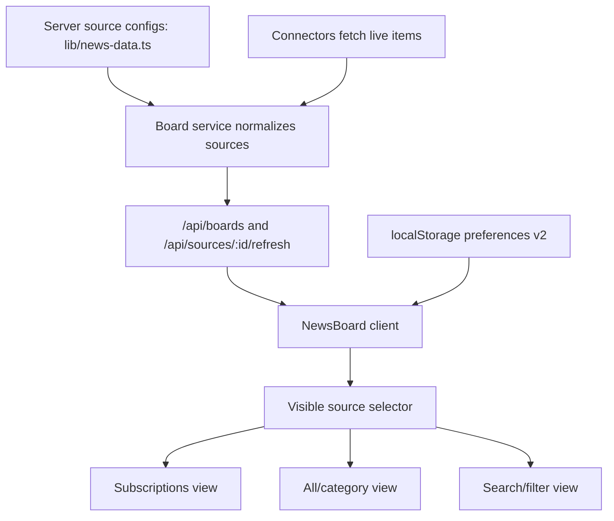

# Source Subscriptions And PC Polish Implementation Plan

> **For Claude:** REQUIRED SUB-SKILL: Use superpowers:executing-plans to implement this plan task-by-task.

**Goal:** Add NewsNow-inspired source subscriptions, source ordering, and PC-focused UI polish to AnyKnews while preserving the current dense information-link aggregation experience.

**Architecture:** Keep AnyKnews in the current no-database runtime. Server APIs continue to fetch and cache source data in memory; browser-side preferences own source subscription, source order, collapsed state, and view mode through localStorage. The UI will gain a "我的订阅" source-first workflow, but PC cards remain compact and do not copy NewsNow's tall mobile reading cards or per-card internal scroll as the default.

**Tech Stack:** Next.js App Router, React client component state, TypeScript, localStorage, existing `/api/boards` and `/api/sources/[sourceId]/refresh` APIs, lucide-react icons, existing CSS without adding a new UI framework.

---

## Product Decisions

- Borrow from NewsNow: source subscription, source ordering, focus-first home, source management, card action polish, source display type, source metadata model.
- Do not borrow for PC default: tall 500px cards, horizontal mobile card deck as the primary PC layout, heavy animated drag surface, login-first preference sync.
- Keep current positioning: a PC browser information-link aggregation dashboard for fast scanning, with title, summary, source, metric, and jump link.
- First implementation stores all preferences locally. Future account sync can be added without changing the core source model.
- Existing article favorites and keyword preferences stay useful, but source-level preferences become the primary personalization layer. The unread/read filter is removed from the primary UI.

## Target User Flows

1. First visit
   - User sees the same full source set as the current version, now under "我的订阅" by default.
   - A clear "订阅" or star button appears on each source card.
   - "我的订阅" is the first navigation item.

2. Subscribe to sources
   - All current sources start subscribed so the first-run experience stays unchanged.
   - User can unstar sources to remove them from "我的订阅".
   - "我的订阅" shows only subscribed sources.
   - Opening the page defaults to "我的订阅".

3. Manage sources
   - User opens a source management drawer.
   - Sources are grouped by category.
   - User can subscribe/unsubscribe, hide/show, reset to defaults, and drag sources to reorder.

4. Read on PC
   - Cards keep a compact, equal-height grid.
   - Default page still shows 8 items per card with pagination for 50 fetched items.
   - Titles and summaries remain the main information surface.

5. Refresh
   - User can refresh all visible sources.
   - User can refresh one source.
   - Loading and fallback state are obvious but not visually noisy.

## Data Model Changes

### Source Metadata

Extend `NewsSource` in `lib/news-data.ts`:

```ts
export type SourceDisplayType = "rank" | "timeline" | "article";

export type NewsSource = {
  id: string;
  category: NewsCategory;
  logo: string;
  tone: "ai" | "tech" | "news" | "biz" | "ent" | "fin" | "car";
  name: string;
  board: string;
  footer: string;
  displayType: SourceDisplayType;
  defaultSubscribed?: boolean;
  color?: "blue" | "red" | "green" | "amber" | "teal" | "slate" | "violet" | "rose";
  priority?: number;
  items: NewsItem[];
};
```

Initial mapping:

- `rank`: 知乎、今日头条、GitHub Trending、B站、雪球热门话题
- `timeline`: 财新、澎湃、36氪资讯推荐、汽车之家、量子位、AIbase
- `article`: V2EX、游民星空 or sources where summaries matter more than ranking

Default subscribed sources:

- Preserve the current version's full visible source set.
- Initialize `subscribedSourceIds` to all configured source IDs, ordered by current category/source order.
- Users can later unsubscribe or hide sources to make "我的订阅" narrower.

### Local Preferences

Extend `LocalPreferences` in `components/news-board.tsx`:

```ts
type LocalPreferences = {
  favoriteItemIds: string[];
  hiddenItemIds: string[];
  includeKeywords: string[];
  excludeKeywords: string[];
  showHidden: boolean;
  subscribedSourceIds: string[];
  hiddenSourceIds: string[];
  sourceOrder: string[];
  defaultView: "subscriptions" | "all";
  collapsedSourceIds: string[];
};
```

Migration rule:

- If older preferences do not have `subscribedSourceIds`, initialize from all current source IDs.
- Preserve article favorites and keyword preferences.
- Do not migrate `readItemIds` into a visible unread workflow.
- Keep the current storage key only if migration is explicit and tested; otherwise bump to `anyknews.preferences.v2`.

## UI Architecture

### Page Modes

Replace the current view-mode mental model with two layers:

- Scope: `subscriptions | all | category`
- Item tools: search, keyword include/exclude, article favorites

Implementation can start smaller:

- Add `subscriptions` as the first top-level nav entry, displayed as "我的订阅".
- Remove the visible unread/read filter.
- Keep article favorites and keyword filtering as available tools.

### Header

PC header should include:

- Brand
- "我的订阅"
- Category anchors
- Search
- Refresh visible sources
- Source manager button
- Status pill

Do not add explanatory product text into the app chrome.

### Source Card

Each source card should include:

- Source logo/name
- Board subtitle
- Updated time/status
- Source home link
- Refresh button
- Subscribe/star button
- More menu button if needed

Card body should render by `displayType`:

- `rank`: ranking number or metric emphasized
- `timeline`: relative time / published time emphasized
- `article`: title plus summary emphasized

PC card height:

- Keep compact and equal-height.
- Do not use NewsNow's 500px card height as default.
- Keep 8 visible items per card and existing pagination for more items.

### Source Manager Drawer

Drawer sections:

- Subscribed sources
- All sources grouped by category
- Hidden sources
- Reset preferences

Controls:

- Star toggle for subscription
- Eye toggle for hidden
- Drag-and-drop source ordering in the first version
- Reset order and subscriptions

## Technical Architecture



Key boundary:

- Server knows source metadata and live items.
- Client owns personalization.
- No database required for this iteration.
- No notification changes in this iteration.

## Risks And Mitigations

- Risk: localStorage migration breaks old article preferences.
  - Mitigation: create a `normalizePreferences` helper with unit coverage or a focused manual test matrix.

- Risk: source-level filtering conflicts with existing item-level hidden/read/favorite logic.
  - Mitigation: apply source filters first, then keyword/favorite item filters. Remove read/unread from the primary flow.

- Risk: source manager drawer becomes too heavy.
  - Mitigation: keep controls focused on subscribe, hide, drag reorder, and reset. Avoid adding account sync or advanced rules in this pass.

- Risk: card design becomes too much like NewsNow and less useful on PC.
  - Mitigation: keep compact card height, 8 visible items, pagination, and current dense grid.

- Risk: forced refresh all sources remains slow.
  - Mitigation: "refresh visible sources" only refreshes the currently visible source IDs.

## Acceptance Criteria

- User can subscribe/unsubscribe a source from a source card.
- On first visit, "我的订阅" contains all current sources, preserving the current full-board experience.
- User can open "我的订阅" and see only subscribed sources.
- Page opens to "我的订阅" by default.
- User can hide/unhide sources from the source manager.
- User can reorder subscribed sources with drag-and-drop.
- Preferences persist after refresh.
- Existing article favorites and keyword preferences still work.
- Visible unread/read filter is removed.
- PC layout remains dense, equal-height, and readable.
- Source cards show clearer refresh/subscription/status controls.
- Lint and production build pass.

## Iteration Plan

### Task 1: Source Metadata Foundation

**Files:**
- Modify: `lib/news-data.ts`
- Modify: `lib/board-service.ts`
- Test/verify: `npm run lint`

**Steps:**

1. Add `SourceDisplayType` and optional source metadata fields.
2. Add `displayType`, `defaultSubscribed`, `color`, and `priority` to each source.
3. Extend `BoardSource` to expose these metadata fields to the client.
4. Verify `/api/health` and `/api/boards` still serialize all sources.
5. Run `npm run lint`.

### Task 2: Preference Model V2

**Files:**
- Modify: `components/news-board.tsx`
- Test/verify: browser localStorage migration

**Steps:**

1. Add `LocalPreferences` v2 fields.
2. Write `normalizePreferences(raw, sources)` helper.
3. Migrate old preferences without losing item-level favorites, hidden items, or keyword preferences.
4. Add helpers:
   - `isSourceSubscribed(sourceId)`
   - `toggleSourceSubscription(sourceId)`
   - `hideSource(sourceId)`
   - `showSource(sourceId)`
   - `reorderSources(activeSourceId, overSourceId)`
5. Manually test with empty localStorage and existing v1 localStorage.

### Task 3: My Subscriptions View

**Files:**
- Modify: `components/news-board.tsx`
- Modify: `app/globals.css`

**Steps:**

1. Add top-level "我的订阅" nav item.
2. Add source filtering for subscribed sources.
3. Put "我的订阅" first in the navigation.
4. Default to subscriptions on page open.
5. Show a compact empty state if no sources are subscribed after user customization.
6. Remove the visible unread/read filter.
7. Keep article favorites and keyword filtering available.
8. Keep category anchors for all-source browsing.
9. Verify source cards still dynamically fill rows on PC.

### Task 4: Source Card Actions

**Files:**
- Modify: `components/news-board.tsx`
- Modify: `app/globals.css`

**Steps:**

1. Add source-level star button next to refresh.
2. Add source home external-link button if missing.
3. Improve refresh loading state per card.
4. Keep article external links opening in new tab.
5. Add tooltips via `title` attributes for icon buttons.

### Task 5: Source Manager Drawer With Drag Reorder

**Files:**
- Modify: `components/news-board.tsx`
- Modify: `app/globals.css`

**Steps:**

1. Reuse the current settings drawer shell if possible.
2. Add "信息源" tab or section.
3. Render sources grouped by category.
4. Add subscribe/unsubscribe controls.
5. Add hide/show controls.
6. Add drag-and-drop ordering for subscribed sources.
7. Add reset source preferences.
8. Verify drawer works at desktop widths and does not overflow.
9. Verify drag ordering persists after page reload.

### Task 6: Display Type Rendering

**Files:**
- Modify: `components/news-board.tsx`
- Modify: `app/globals.css`

**Steps:**

1. Add `renderRankItem`, `renderTimelineItem`, and `renderArticleItem`.
2. Map source `displayType` to renderer.
3. Keep titles and summaries fully available without increasing card height unpredictably.
4. Preserve 8 items per page and existing pagination.
5. Verify 知乎/GitHub/B站 feel like rank lists, and 36氪/汽车之家/财新 feel like news timelines.

### Task 7: Refresh Visible Sources

**Files:**
- Modify: `components/news-board.tsx`

**Steps:**

1. Change global refresh action to refresh only currently visible sources.
2. Keep a fallback option for full refresh if useful.
3. Show summary based on visible source count.
4. Verify refresh no longer waits on hidden/unsubscribed sources.

### Task 8: Documentation And Verification

**Files:**
- Modify: `README.md`
- Modify: `docs/tencent-cloud-deploy.md` if API/runtime behavior changes

**Steps:**

1. Document no-database local personalization.
2. Document localStorage reset path.
3. Run `npm run lint`.
4. Run `npm run build`.
5. Start local dev server.
6. Verify in browser:
   - Subscribe source
   - Open subscriptions
   - Drag reorder source
   - Hide source
   - Use article favorites
   - Use keyword filters
   - Refresh visible sources
   - Reload page and confirm persistence

## Proposed Release Strategy

1. Develop and verify locally.
2. User acceptance on `localhost:3001`.
3. Commit and push.
4. Deploy only AnyKnews app on Tencent Cloud from Git.
5. Verify `/api/health`, public homepage, and one subscribed-source workflow.

## User Confirmed Decisions

- 默认订阅源保持当前版本不变：首访时所有当前源都在 "我的订阅" 中可见。
- "我的订阅" 放在导航第一位。
- 源排序第一版直接做拖拽。
- 保留文章收藏和关键词能力；移除未读/已读作为主筛选入口。
