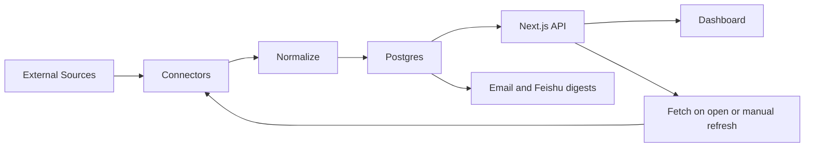

# Personal News Aggregation Platform Design

Date: 2026-04-27

## Goal

Build a private, highly customized information-link aggregation platform inspired by AnyKnew and TopHub. The product should help the owner scan many sources quickly, read only source-provided short summaries when available, and jump to original sources.

The project name is AnyKnews. The first version is for personal use on a Tencent Cloud server. It does not require login. It stores only titles, short summaries, source metadata, and original links. No domain is required for V1.

## Design References

- AnyKnew: compact multi-source hot list cards, lazy loading, source-based boards, archive links.
- TopHub AI page: dense category-first reading, source cards, ranked lists, clear update timing.

TopHub was unavailable during direct fetch attempts with a `503 Service Temporarily Unavailable`, so the reference is based on the visible product pattern and publicly indexed descriptions: multi-source hot榜 aggregation, simple reading, category/source grouping, and compact ranking lists.

## V1 Information Sources

| Category | Sources | V1 Strategy |
| --- | --- | --- |
| AI news | QbitAI, Machine Heart | RSS/RSSHub first, fallback to page parsing |
| Tech | GitHub Trending, V2EX | GitHub Trending all-site top 10, V2EX hot topics |
| General news | Zhihu hot list, Toutiao hot board, The Paper | Zhihu realtime refresh, Toutiao JSON, RSS/page parsing for The Paper |
| Tech business | 36Kr | Official RSS |
| Entertainment | Bilibili popular, Gamersky | Bilibili web API, Gamersky RSS/page parsing |
| Finance | Xueqiu, Caixin | Public web/RSS/page parsing, title/link only |
| Automotive | Autohome | RSS feeds for news/reviews/advice |

## Active Alerts

| Alert | Timing | Channel | Content |
| --- | --- | --- | --- |
| Daily AI digest | Every day at 10:00 Asia/Shanghai | Email and Feishu | Previous day's QbitAI and Machine Heart items. Email includes 20 items; Feishu includes 10 items |
| GitHub Trending top 10 | Daily, included in the 10:00 morning message | Email and Feishu | All-language GitHub Trending top 10 repositories |
| Zhihu hot list | Realtime dashboard refresh and manual refresh | Web dashboard | Current Zhihu hot list top 10; no keyword push in V1 |

## Keywords

Initial tracked keywords:

- AI agent
- 机器人
- 项目管理

Keyword matching should support case-insensitive English matching, Chinese substring matching, and later synonym expansion.

## Product Experience

### Homepage

The homepage is the primary working surface. It should open directly to useful content, not a marketing page.

Layout:

- Top navigation bar: project name, lightweight category anchors, global search icon, global manual refresh.
- Single-page card wall: all categories are stacked vertically in this order: AI news, Tech, General news, Tech business, Entertainment, Finance, Automotive.
- Each category is a dense grid of source cards. On desktop use 3-4 columns; on mobile use one column.
- No overview switcher and no separate detail-heavy homepage mode.
- Zhihu card must support realtime auto-refresh and manual refresh.

Visual direction:

- Dense but polished, closer to a hot-list link wall than a media/news article site.
- Light default theme with a calm editorial feel.
- Avoid oversized hero sections and decorative cards.
- Use stable card/grid dimensions so rankings do not shift layout. Cards should be compact and scannable.
- Keep source cards readable on desktop and mobile.
- Avoid large single-news blocks. The page is a link aggregation surface, not a content detail surface.

### Source Card

Each source card shows:

- Source logo or short text mark
- Source display name and board name
- Last successful fetch time
- Fetch status
- Ranked or bulleted list of compact items
- Item title, optional one-line summary, optional heat score
- Click opens `/go/:itemId`, which records click and redirects to the original URL
- Footer actions: refresh source, open source homepage, optional favorite/star

Card constraints:

- Default visible items: 8-10 per card.
- Each item should usually fit in 1-3 lines.
- Summary is optional and should stay short. If a source has no summary, show title only.
- Cards can scroll internally only when necessary, but the first screen should prioritize scanning.

### Digest View

The digest view shows generated summaries:

- Daily AI digest
- GitHub Trending top 10
- Zhihu hot list snapshot
- Optional saved historical digests

There is no LLM-generated digest in V1 unless a model key is added later. The initial digest is an editorial list assembled from titles, source summaries, links, and source metadata.

### Admin / Ops View

No login is required in V1, but an internal admin route should exist:

- Source status
- Last fetch time
- Error count
- Latest raw payload preview
- Manual refetch button

If the app is exposed publicly, the admin route should be protected by IP allowlist or a simple server-side secret path.

## Architecture

## Recommended Technology

| Layer | Choice | Rationale |
| --- | --- | --- |
| Frontend and API | Next.js | Good fit for dashboard UI, server routes, compact cards, and fast deployment |
| Styling | Tailwind CSS plus CSS variables | Fast iteration with controlled dense card design |
| Database | Postgres | Relational source/item/digest data, full-text search available |
| Refresh model | Fetch on page open and manual refresh | Reduces API usage and avoids background polling in V1 |
| Background jobs | Minimal Node.js cron only for daily digest delivery if needed | Keep source fetching user-triggered; do not refresh every source in the background |
| Cache/queue | Redis optional | Short-lived cache and rate control only if source APIs need it |
| RSS parsing | rss-parser | Simple for RSS/Atom sources |
| HTML parsing | Cheerio first, Playwright only when needed | Keep scraping lightweight; browser automation as fallback |
| Email | 163 SMTP via environment variables | Daily digest delivery |
| Feishu | Incoming webhook bot | Simple digest and alert push |
| Deployment | Docker Compose on Tencent Cloud CVM | Simple, portable, easy to operate |

## Confirmed Deployment Target

| Item | Value |
| --- | --- |
| Cloud | Tencent Cloud Lighthouse |
| Instance name | OpenClaw(龙虾)-IMj6 |
| Instance ID | `lhins-qfndrfd9` |
| Region | Singapore / Singapore Zone 2 |
| Public IPv4 | `101.32.251.91` |
| Private IPv4 | `10.3.0.15` |
| CPU / Memory | 2 vCPU / 2 GB |
| Disk | 50 GB SSD |
| Bandwidth package | 1024 GB/month, 30 Mbps peak |
| OS | Ubuntu Server 24.04 LTS 64bit |
| Default SSH user | `ubuntu` |
| SSH key | `anyknew_dev`, bound to `lhins-qfndrfd9` |
| Current firewall | TCP 22, TCP 80, and ICMP |
| SSH status | Verified from local machine as `ubuntu` |
| Runtime status | Docker 29.4.1 and Docker Compose v5.1.3 installed |
| Disk usage | 50 GB root disk, about 37 GB available at inspection time |
| Memory | 2 GB RAM with swap enabled |

Deployment notes:

- Local SSH login is available with the bound `anyknew_dev` key.
- TCP 80 is open for browser access. TCP 443 can wait until a domain is available.

## Data Model

### `sources`

Stores source-level configuration.

Fields:

- `id`
- `slug`
- `name`
- `category`
- `type`: `rss`, `api`, `html`, `browser`
- `enabled`
- `fetch_interval_minutes`
- `weight`
- `config_json`
- `created_at`
- `updated_at`

### `items`

Stores normalized content.

Fields:

- `id`
- `source_id`
- `external_id`
- `title`
- `summary`
- `url`
- `rank`
- `score`
- `published_at`
- `fetched_at`
- `content_hash`
- `raw_json`

### `digests`

Stores generated digests.

Fields:

- `id`
- `type`: `daily_ai`, `github_trending`, `zhihu_snapshot`
- `period_start`
- `period_end`
- `title`
- `content_markdown`
- `sent_email_at`
- `sent_feishu_at`
- `created_at`

### `alert_rules`

Stores proactive alert rules.

Fields:

- `id`
- `name`
- `rule_type`
- `keywords`
- `sources`
- `schedule`
- `channels`
- `enabled`

### `fetch_runs`

Stores operational history.

Fields:

- `id`
- `source_id`
- `status`
- `started_at`
- `finished_at`
- `items_found`
- `items_saved`
- `error_message`

### `click_logs`

Stores redirects.

Fields:

- `id`
- `item_id`
- `clicked_at`
- `referrer`

## Connector Plan

Refresh policy:

- Opening the dashboard triggers a board refresh request.
- The global refresh button asks eligible sources to refresh on demand.
- Each source card can refresh only that source.
- Source connectors should respect `fetch_interval_minutes` as a minimum freshness window, so repeated page refreshes do not call external APIs unnecessarily.
- Background refresh is not part of P3. Background jobs are reserved for delivery workflows such as the 10:00 AI digest.

| Source | Connector Type | Notes |
| --- | --- | --- |
| QbitAI | RSS/RSSHub or HTML | Verify stable feed URL before implementation |
| Machine Heart | RSS/RSSHub or HTML | Verify stable feed URL before implementation |
| GitHub Trending | HTML parser | Parse `https://github.com/trending`, keep top 10 all-site |
| V2EX | API or HTML | Use hot/recent topics; respect rate limits |
| Zhihu | API/HTML | Realtime and manual refresh; likely needs anti-bot handling |
| Toutiao | API JSON | Hot board endpoint, add headers if required |
| The Paper | RSS/HTML | Prefer RSS if stable |
| 36Kr | Official RSS | Use `https://36kr.com/feed` and related feeds |
| Bilibili | API | Use popular/ranking web API |
| Gamersky | RSS/HTML | Prefer RSS if stable |
| Xueqiu | HTML/API | Title/link only; be conservative with rate |
| Caixin | RSS/HTML | Title/link only due paywall/copyright |
| Autohome | RSS | News/review/advice RSS feeds |

## Refresh Policy

| Source Group | Frequency |
| --- | --- |
| Zhihu hot list | Every 5 minutes if stable; otherwise degrade to 10-30 minutes |
| Toutiao, Bilibili | Every 15-30 minutes |
| GitHub Trending | Daily, plus optional manual refresh |
| AI media | Hourly, digest daily at 10:00 for previous day |
| Finance/general media/RSS | Every 30-60 minutes |
| Autohome/Gamersky | Every 60 minutes |

## Summary Policy

V1 should not depend on an LLM. It should use source-provided descriptions/summaries when available and otherwise show titles only.

Summary rules:

- Do not call a model API in V1.
- Do not generate long per-item summaries.
- Keep digest entries short: title, optional source summary, source, and link.
- Add LLM summaries later behind `LLM_API_KEY` and a feature flag.

## Security and Legal Boundaries

- Store only title, short summary, source, timestamps, and link.
- Do not store full copyrighted article text.
- Respect source rate limits and cache responses.
- If deployed publicly, do not expose admin operations without protection.
- Keep Feishu webhook, email credentials, and model API keys in environment variables.
- Do not commit email passwords, SMTP authorization codes, Feishu webhook URLs, or cloud credentials.
- Retain data for 7 rolling days in V1. Do not run backups in V1.

## V1 Milestones

### V0: Project Skeleton and Design System

- Scaffold app
- Define source configuration
- Build static dashboard with sample data
- Establish compact source-card wall inspired by the provided TopHub-style screenshot

### V1: Core Aggregation

- Postgres schema
- Source connectors for 36Kr, GitHub Trending, V2EX, Toutiao, Bilibili, Autohome
- Dashboard source cards
- `/go/:itemId` redirect tracking
- 7-day retention cleanup job

### V1.1: AI Digest

- QbitAI and Machine Heart connectors
- Daily AI digest for previous day
- Email delivery with 20 items and Feishu delivery with 10 items at 10:00 Asia/Shanghai
- Include GitHub Trending top 10 in the same morning message

### V1.2: Zhihu Realtime

- Zhihu connector
- 5-minute dashboard refresh if stable
- Manual refresh button on the Zhihu card
- Show top 10 only in V1

### V1.3: Remaining Sources

- The Paper
- Gamersky
- Xueqiu
- Caixin

### V2: Personalization

- Include/exclude keyword rules
- Source/category weights
- Read/favorite/ignore state
- Search and historical archives

### V3: Intelligence

- Event clustering
- Cross-source trend detection
- Topic timelines
- Weekly review

## User Prerequisites

Before implementation, the owner needs to provide:

- Tencent Cloud CVM target: OS, CPU/RAM, public IP, SSH user, deployment directory.
- Feishu incoming webhook URL, provided outside the repository and stored only in deployment environment variables.
- Whether the app will be public internet accessible or private only.

Already confirmed:

- Project name: AnyKnews.
- Domain: none for now.
- Deployment: Tencent Cloud server.
- Docker Compose is acceptable.
- Timezone: Asia/Shanghai.
- Email provider: 163 SMTP, with credentials supplied outside the repository.
- Email recipients: two addresses supplied outside the repository.
- Feishu channel: webhook provided outside the repository.
- LLM summary: disabled for now.
- GitHub Trending: all-language all-site top 10.
- Homepage: one card-wall page; no overview switcher.
- Zhihu: realtime dashboard refresh plus manual refresh, top 10 only.
- AI digest: email 20 items, Feishu 10 items.
- Finance preference: A-shares, US stocks, technology companies.
- Data retention: 7 rolling days.
- Backup: disabled in V1.
