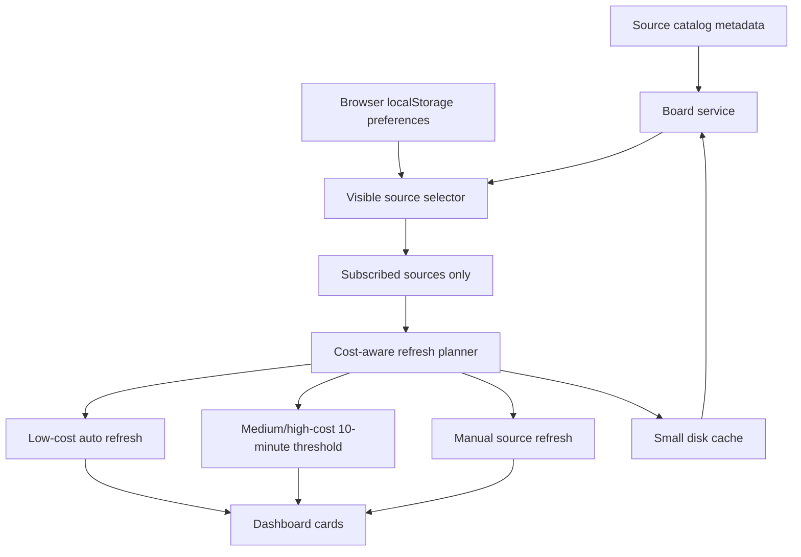

# AnyKnews V1.1 Source Catalog And Cost Control Design

## Status

Implemented as V1.1 release candidate after local verification on 2026-05-09.

This version follows the project working agreement: each version upgrade gets a dedicated version branch and a matching feature requirements design document. The branch for this design is `v1.1`.

## Goal

V1.1 upgrades AnyKnews from a fixed-source dashboard into a cost-controlled source catalog.

The product should know about more sources, but it should only fetch content for sources that the user has actively subscribed to, opened, or manually refreshed. This preserves the lightweight no-login model while avoiding unnecessary traffic, anti-crawl pressure, and future AI token cost.

## Product Principles

- More sources should not make the homepage slower by default, but subscribed cards should still show fresh first-page data when the page opens.
- Unsubscribed sources should not fetch content.
- Source management is the only place where unsubscribed catalog sources appear.
- Source preferences remain browser-local in `localStorage`.
- Low-cost subscribed sources must refresh on page open when stale.
- Medium/high-cost subscribed sources refresh on page open only when their last successful refresh is more than 10 minutes old.
- Source cards fetch additional pages lazily instead of eagerly returning every fetched item in the initial board payload.
- The server keeps a small disk cache containing source metadata plus item title, summary, and link only.
- AI token usage is out of scope for V1.1 and must not run automatically.

## Scope

### In Scope

- Add a source catalog with about 15 new sources.
- Keep the homepage focused on subscribed sources only.
- Upgrade the information-source manager into a catalog surface.
- Display each catalog source as a compact `icon + title` record, with light status/cost metadata.
- Support drag-and-drop to add sources to `我的订阅`.
- Support drag-and-drop or a direct remove action to remove sources from `我的订阅`.
- Preserve subscribed source ordering through drag-and-drop.
- Add source-level cost metadata and refresh policy metadata.
- Only auto-fetch newly subscribed low-cost sources.
- Keep medium/high-cost newly subscribed sources in a pending/manual refresh state until manual refresh or their 10-minute freshness threshold is reached.
- Add a small disk cache for source/item data and failed-fetch backoff state.
- Fix single-card refresh so the viewport returns to the refreshed card's top.

### Out Of Scope

- Login or account sync.
- Server-side persistent subscription storage.
- Database introduction.
- AI summarization or AI event clustering beyond the current non-token local heuristics.
- Aggressively bypassing anti-crawl protections.
- Making every new source live in the first pass if the source blocks anonymous access.

## Source Additions

### Technology, AI, And Development

| Source | Initial Cost | Initial Strategy |
| --- | --- | --- |
| Hacker News | Low | Prefer official/API-style feed or stable public endpoint |
| Anthropic News | Low | Prefer RSS or official news page parsing |
| InfoQ | Low | Prefer RSS or lightweight page parsing |
| 少数派 | Low | First-party hot article API connector |

### Business, Finance, And Automotive

| Source | Initial Cost | Initial Strategy |
| --- | --- | --- |
| 虎嗅 | Low/Medium | RSSHub channel connector with route fallback |
| 界面 | Low/Medium | Prefer RSS or lightweight page parsing |
| 华尔街见闻 | Medium | Prefer public feed/API if stable; otherwise budgeted HTML |
| 东方财富 | Medium | Prefer public market/news endpoint |
| 懂车帝 | Medium | 60s API hot-search connector |
| 晚点 | Medium | Prefer RSS/page parsing; allow catalog-only fallback |
| 钛媒体 | Low/Medium | Prefer RSS or lightweight page parsing |

### General And Community

| Source | Initial Cost | Initial Strategy |
| --- | --- | --- |
| 微博热搜 | Medium | 60s API hot-search connector |
| 抖音热点 | High | 60s API hot-search connector |
| 小红书热点 | High | 60s API rednote hot connector |
| 豆瓣 | Low/Medium | RSSHub list connector with route fallback |

## Source Cost Model

Extend source metadata with a cost and refresh policy model.

```ts
type SourceFetchCost = "low" | "medium" | "high";
type SourceRefreshPolicy = "auto" | "budgeted" | "manual";

type NewsSource = {
  fetchCost: SourceFetchCost;
  refreshPolicy: SourceRefreshPolicy;
  catalogOnly?: boolean;
};
```

Meaning:

- `low + auto`: eligible for page-open stale refresh and immediate fetch after subscription.
- `medium + budgeted`: eligible for page-open refresh only when the source is older than 10 minutes, or when the user refreshes it directly.
- `high + manual`: skipped when fresh within 10 minutes; otherwise eligible for explicit/manual or controlled page-open refresh depending on connector stability.
- `catalogOnly`: appears in the source catalog but has no stable live connector yet.

## Refresh Rules

### Page Open

- Load existing cached data first.
- Determine subscribed sources from `localStorage`.
- Stale refresh only subscribed sources.
- Skip unsubscribed catalog sources entirely.
- Ensure every subscribed source card has current first-page data when the page opens.
- Low-cost subscribed sources must refresh when stale.
- Medium/high-cost subscribed sources check their last successful refresh time before fetching.
- Medium/high-cost subscribed sources fetch on page open only if their last successful refresh is more than 10 minutes old.
- If a medium/high-cost source is younger than 10 minutes, serve its memory or disk cache result.
- Initial board payload should include source metadata plus the first 8 items per subscribed source.
- Additional source items are fetched lazily when the user pages within a card.

### Source Subscription

When a user adds a source to `我的订阅`:

- Low-cost source: subscribe, insert into order, and trigger one source refresh.
- Medium-cost source: subscribe and show a pending refresh state until manual refresh or the 10-minute freshness threshold allows page-open refresh.
- High-cost source: subscribe and show manual/cost-aware refresh state until manual refresh or a controlled refresh is allowed.
- Catalog-only source: subscribe and show `待接入` or fallback state until a connector exists.

### Manual Refresh

- Card-level refresh targets only that source.
- Header refresh targets currently visible subscribed sources.
- High-cost sources can be manually refreshed, but the UI should make the cost state visible.
- After card-level refresh starts or completes, the viewport should scroll to the top of that source card.
- User pagination within a card should fetch more items for that single source instead of requiring the initial board response to include all items.

## Server Cache And Backoff

- Keep the current memory cache for hot runtime reads.
- Add a small disk cache for cold starts and container restarts.
- Disk cache stores only compact source and item fields: source id, source metadata, title, summary, link, metric, published time, updated time, and diagnostic state.
- Disk cache must not store full HTML, article bodies, images, or large raw payloads.
- Failed source fetches write a backoff record.
- Backoff prevents repeated automatic retries against a failing source.
- Manual refresh may bypass or shorten backoff, but should still preserve clear failure diagnostics.
- Disk cache should be safe to delete; the app can rebuild it from live fetches and seed data.

## Source Manager UX

The source manager remains the only place where catalog-only and unsubscribed sources appear.

Layout:

```text
我的订阅
[icon 量子位] [icon AIbase] [icon GitHub] ...

可添加来源
技术 / AI / 开发
[icon Hacker News] [icon Anthropic] [icon InfoQ] [icon 少数派]

商业 / 财经 / 汽车
[icon 虎嗅] [icon 界面] [icon 华尔街见闻] ...

综合 / 社区
[icon 微博热搜] [icon 抖音热点] [icon 小红书热点] [icon 豆瓣]
```

Interaction rules:

- Drag a catalog source into `我的订阅` to subscribe.
- Drag within `我的订阅` to reorder.
- Remove from `我的订阅` via drag-out or direct action.
- Unsubscribing hides the source from homepage/category views.
- Unsubscribing does not delete article favorites, hidden items, or keyword preferences.
- Each source row stays compact and emphasizes `icon + title`.
- Cost/status metadata should be present but visually light.

## Data Flow



## Error Handling

- Failed source fetches keep the last successful cached data when available.
- If no live data exists, use typed seed or catalog fallback.
- Repeated failures should apply backoff before another automatic attempt.
- Backoff state should survive server restart through the small disk cache.
- The source manager should expose source status without making the homepage noisy.
- Strong anti-crawl sources can remain catalog-only until a stable low-cost integration is found.

## Acceptance Criteria

- A `v1.1` branch exists for this version's design and implementation.
- A V1.1 design document exists under `docs/superpowers/specs/`.
- Existing homepage behavior remains unchanged for current default subscribed sources.
- Unsubscribed new sources do not appear on the homepage.
- Unsubscribed new sources do not fetch content on page open.
- Subscribed cards show first-page data on page open.
- Low-cost subscribed sources refresh when stale on page open.
- Medium/high-cost subscribed sources do not refetch on page open if they refreshed successfully within the last 10 minutes.
- Initial board payload contains only the first 8 items per source.
- Card pagination fetches additional items for that source on demand.
- Server disk cache stores only compact title, summary, link, source metadata, and diagnostics.
- Failed source fetches apply backoff.
- Source manager shows subscribed sources and catalog sources.
- Catalog source records are compact and include icon/title.
- Dragging a source into `我的订阅` subscribes it.
- Dragging/reordering subscribed sources persists in `localStorage`.
- Low-cost newly subscribed sources can refresh automatically.
- Medium/high-cost newly subscribed sources respect the 10-minute freshness threshold unless the user refreshes them manually.
- Single-source refresh scrolls to the top of that card.
- Lint and production build pass before merge.

## Open Implementation Notes

- Connector research should prefer official RSS, stable JSON, RSSHub, and DailyHotApi before custom HTML scraping.
- New source connectors may be added as catalog-only placeholders when no stable low-cost path is found quickly.
- The first implementation should keep the current no-database deployment model.
- If the catalog grows beyond 30-40 sources later, revisit server-side persistence and search/filtering inside the source manager.
